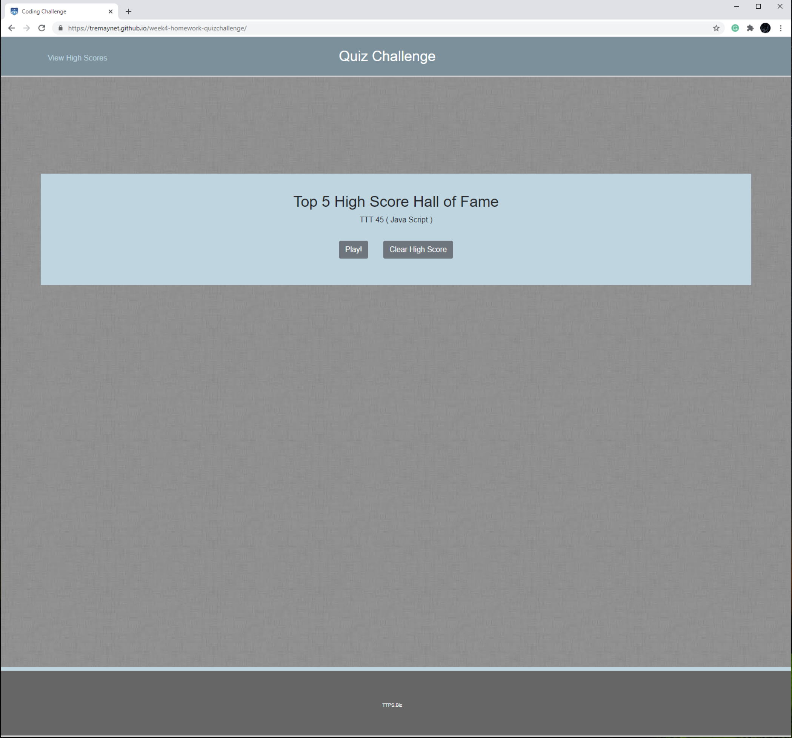

##### week4-homework-quizchallenge ######

## Purpose 

The purpose of this homework is to demonstrate the following skills:

Utilize Web Storage API to store the high score

Utilize a timer to control events within the Javasscript

Store information in arrays of objects

Dynamically update the DOM

Create a responsive site

This view of the application displays two buttons to start the JavaScript or the jQuery quiz. Clicking the button displays a series of questions; once the examination begins, the timer starts. If the user chooses and incorrect answer, a penalty of ten seconds is applied. The View high Score button provided the ability to review the top five high scores.

This view of the application provides the questions and possible answers along with the timer in the right upperhand cornet. If the user chooses and incorrect answer, a penalty of ten seconds is applied. Correct questions are green, and incorrect items are red.  

This view of the application provide the user the ability to savew their initials and score. 
 
 

This view of the application allows the user to play again or clear scores. 

 
